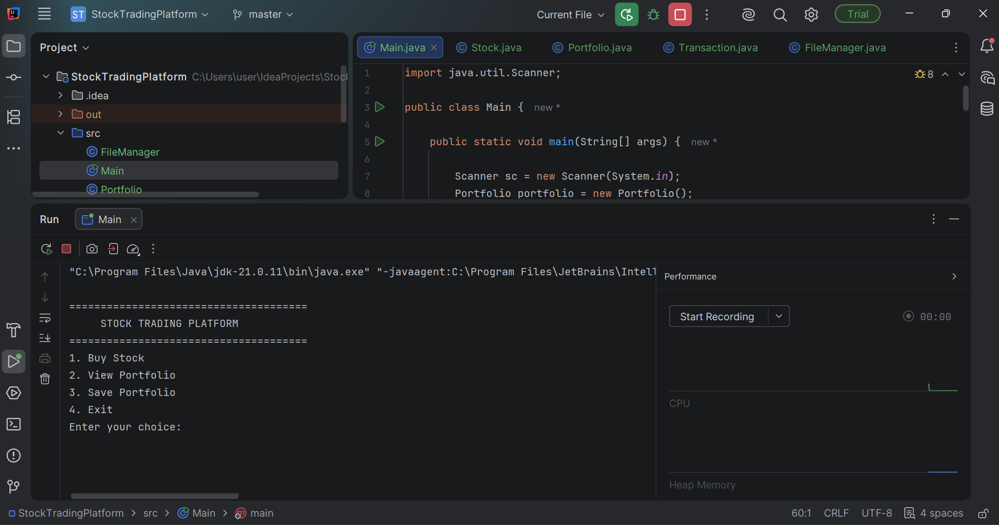
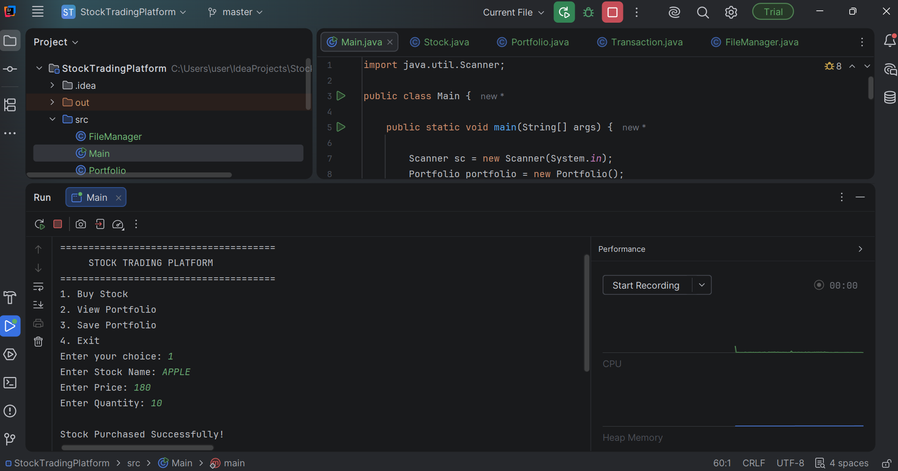
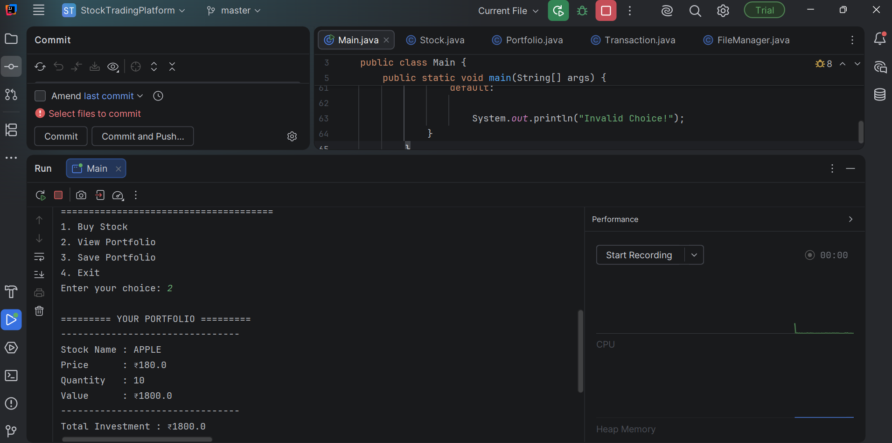
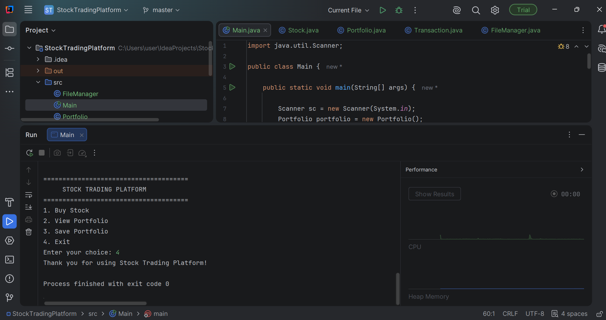

# 📈 Stock Trading Platform

A Java console-based **Stock Trading Platform** developed as part of the **CodeAlpha Java Programming Internship**.

## 🚀 Features

- Buy Stocks
- View Portfolio
- Calculate Total Investment
- Save Portfolio Report
- Menu-driven Console Application
- File Handling

## 🛠 Technologies Used

- Java
- IntelliJ IDEA
- Object-Oriented Programming (OOP)
- Git & GitHub

## 📂 Project Structure

```text
StockTradingPlatform
│
├── screenshots
│   ├── menu.png
│   ├── buy-stock.png
│   ├── portfolio.png
│   └── exit.png
│
├── src
│   ├── Main.java
│   ├── Stock.java
│   ├── Portfolio.java
│   ├── Transaction.java
│   └── FileManager.java
│
├── .gitignore
├── StockTradingPlatform.iml
└── README.md
```

## ▶️ How to Run

1. Clone this repository.
2. Open the project in IntelliJ IDEA.
3. Run `Main.java`.
4. Select an option from the menu.
5. Buy stocks, view your portfolio, or save the portfolio report.

## 📸 Screenshots

### Main Menu



### Buy Stock



### Portfolio



### Exit



## 👩‍💻 Author

**Kavitha Reddy**

---

⭐ Developed as part of the **CodeAlpha Java Programming Internship**.
